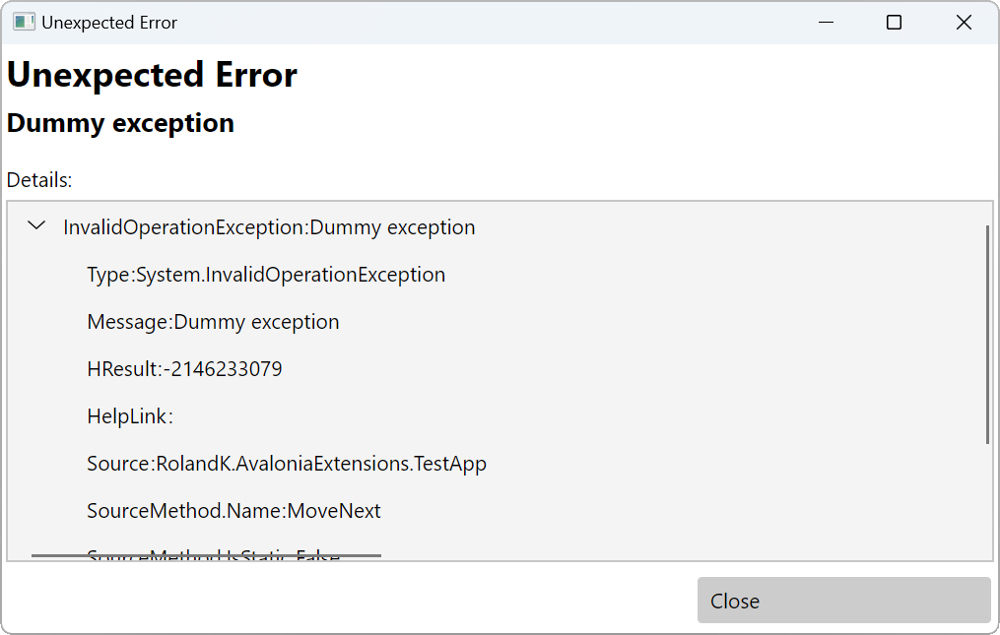

# RolandK.AvaloniaExtensions 
## Common Information
A .NET library which extends Avalonia with commonly used features like ViewServices, 
DependencyInjection and some Mvvm sugar

## Build
[](https://github.com/RolandKoenig/RolandK.AvaloniaExtensions/actions/workflows/continuous-integration.yml)


## Nuget
| Package                                         | Link                                                                          |
|-------------------------------------------------|-------------------------------------------------------------------------------|
| RolandK.AvaloniaExtensions                      | https://www.nuget.org/packages/RolandK.AvaloniaExtensions                     |
| RolandK.AvaloniaExtensions.DependencyInjection  | https://www.nuget.org/packages/RolandK.AvaloniaExtensions.DependencyInjection |
| RolandK.AvaloniaExtensions.ExceptionHandling    | https://www.nuget.org/packages/RolandK.AvaloniaExtensions.ExceptionHandling   |
| RolandK.AvaloniaExtensions.ResponsiveControls   | https://www.nuget.org/packages/RolandK.AvaloniaExtensions.ResponsiveControls  |

## Feature overview
 - [ViewServices over the popular Mvvm pattern by **not** providing an own Mvvm implementation](#viewservices-over-the-popular-mvvm-pattern)
 - [Some default ViewServices (FileDialogs, MessageBox)](#some-default-viewservices)
 - [Notification on ViewModels when view is attaching and detaching](#notification-on-viewmodels-when-view-is-attaching-and-detaching)
 - [DependencyInjection for Avalonia based on Microsft.Extensions.DependencyInjection](#dependencyinjection-for-avalonia-based-on-microsftextensionsdependencyinjection)
 - [Error dialog for unhandled exceptions](#error-dialog-for-unhandled-exceptions)
 - [Global error handling for unhandled exceptions](#global-error-handling-for-unhandled-exceptions)
 - [MarkupExtensions for primitive values](#markupextensions-for-primitive-values)
 - [ResponsiveControls inspired by Bootstrap](#responsivecontrols-inspired-by-bootstrap)

# Samples
Here you find samples to the features of RolandK.AvaloniaExtensions. Most of
these features work for themselves and are self-contained. They have no dependencies to
other features of RolandK.AvaloniaExtensions. As Mvvm framework I use
[CommunityToolkit.Mvvm](https://www.nuget.org/packages/CommunityToolkit.Mvvm) in all samples - but you are free to use another one. 
RolandK.AvaloniaExtensions has no dependencies on any Mvvm library and does not try to be an own implementation.

You can also take a look into the unittest projects. There you find
full examples for each provided feature.

## ViewServices over the popular Mvvm pattern
Add nuget package [RolandK.AvaloniaExtensions](https://www.nuget.org/packages/RolandK.AvaloniaExtensions).

ViewServices in RolandK.AvaloniaExtensions are interfaces provided by views (Windows, UserControls, etc.).
A view attaches itself to a view model using the IAttachableViewModel interface. Therefore, you have to 
implement this interface on your own view models. The following sample implementation is derived
from ObservableObject of CommunityToolkit.Mvvm.

```csharp
using System;
using CommunityToolkit.Mvvm.ComponentModel;
using RolandK.AvaloniaExtensions.Mvvm;
using RolandK.AvaloniaExtensions.ViewServices.Base;

namespace RolandK.AvaloniaExtensions.TestApp;

public class OwnViewModelBase : ObservableObject, IAttachableViewModel
{
    private object? _associatedView;
    
    /// <inheritdoc />
    public event EventHandler<CloseWindowRequestEventArgs>? CloseWindowRequest;
    
    /// <inheritdoc />
    public event EventHandler<ViewServiceRequestEventArgs>? ViewServiceRequest;

    /// <inheritdoc />
    public object? AssociatedView
    {
        get => _associatedView;
        set
        {
            if(_associatedView != value)
            {
                _associatedView = value;
                this.OnAssociatedViewChanged(_associatedView);
            }
        }
    }

    protected T? TryGetViewService<T>()
        where T : class
    {
        var requestViewServiceArgs = new ViewServiceRequestEventArgs(typeof(T));
        this.ViewServiceRequest?.Invoke(this, requestViewServiceArgs);
        return requestViewServiceArgs.ViewService as T;
    }
    
    protected T GetViewService<T>()
        where T : class
    {
        var viewService = this.TryGetViewService<T>();
        if (viewService == null)
        {
            throw new InvalidOperationException($"ViewService {typeof(T).FullName} not found!");
        }

        return viewService;
    }

    protected void CloseHostWindow(object? dialogResult = null)
    {
        if (this.CloseWindowRequest == null)
        {
            throw new InvalidOperationException("Unable to call Close on host window!");
        }
        
        this.CloseWindowRequest.Invoke(
            this, 
            new CloseWindowRequestEventArgs(dialogResult));
    }
    
    protected void OnAssociatedViewChanged(object? associatedView)
    {
        
    }
}
```

Now you can access ViewServices from within the view model by calling
GetViewService or TryGetViewService. The later does not throw an exception,
when the ViewService can not be found. 

In order for that to work, you also have to use one of the base classes MvvmWindow or MvvmUserControl on the
view side. They are responsible for attaching to the view model and detaching again, when
the view is closed. Be sure that you also derive from the correct base class in
the corresponding code behind. 

There is still one problem: The ViewModel (-> DataContext) is also set to all child elements 
automatically by Avalonia. Because of this, we need some kind of functionality to clearly 
identify which View belongs to which ViewModel. By default, RolandK.AvaloniaExtensions provides
a convention using the AvaloniaExtensionsConventions.IsViewForViewModelFunc delegate. This
one checks for the naming, e. g. MainWindowViewModel is the ViewModel for the MainWindow View.
If the naming of the ViewModel differs, then you can override the convention or just set
the ViewModel type using the ViewFor property of MvvmWindow or MvvmUserControl base classes.

```xml
<ext:MvvmWindow xmlns="https://github.com/avaloniaui"
        xmlns:x="http://schemas.microsoft.com/winfx/2006/xaml"
        xmlns:d="http://schemas.microsoft.com/expression/blend/2008"
        xmlns:mc="http://schemas.openxmlformats.org/markup-compatibility/2006"
        xmlns:ext="https://github.com/RolandK.AvaloniaExtensions"
        xmlns:local="clr-namespace:RolandK.AvaloniaExtensions.TestApp"
        mc:Ignorable="d" d:DesignWidth="800" d:DesignHeight="450"
        x:Class="RolandK.AvaloniaExtensions.TestApp.MainWindow"
        ViewFor="{x:Type [YourViewModelTypeHere]}">
</ext:MvvmWindow>
```

Register own ViewServices using the ViewServices property of MvvmWindow or
MvvmUserControl. 

The following code snipped is a command implementation within the view model.
It uses the ViewServices IOpenFileViewServices and IMessageBoxService. Both of
them are provided by default by RolandK.AvaloniaExtensions. 

```csharp
[RelayCommand]
public async Task OpenFileAsync()
{
    var srvOpenFile = this.GetViewService<IOpenFileViewService>();
    var srvMessageBox = this.GetViewService<IMessageBoxViewService>();
    
    var selectedFile =  await srvOpenFile.ShowOpenFileDialogAsync(
        Array.Empty<FileDialogFilter>(),
        "Open file");
    if (string.IsNullOrEmpty(selectedFile)) { return; }
    
    await srvMessageBox.ShowAsync(
        "Open file",
        $"File {selectedFile} selected", MessageBoxButtons.Ok);
}
```

## Some default ViewServices
RolandK.AvaloniaExtensions provides the following default ViewServices:
 - IMessageBoxViewService
 - IOpenDirectoryViewService
 - IOpenFileViewService
 - ISaveFileViewService

## Notification on ViewModels when view is attaching and detaching
As some kind of extension to the provided ViewService feature, the IAttachableViewModel
interface can be used to react on attaching / detaching of the view from within the view model.
You can use this for example to start and stop a timer in the view model.

The following code snipped shows how to write a OnAssociatedViewChanged method
on a view model base class.

```csharp
using System;
using CommunityToolkit.Mvvm.ComponentModel;
using RolandK.AvaloniaExtensions.Mvvm;
using RolandK.AvaloniaExtensions.ViewServices.Base;

namespace RolandK.AvaloniaExtensions.TestApp;

public class OwnViewModelBase : ObservableObject, IAttachableViewModel
{
    private object? _associatedView;
    
    //. ..
    
    /// <inheritdoc />
    public object? AssociatedView
    {
        get => _associatedView;
        set
        {
            if(_associatedView != value)
            {
                _associatedView = value;
                this.OnAssociatedViewChanged(_associatedView);
            }
        }
    }
    
    // ...
    
    protected void OnAssociatedViewChanged(object? associatedView)
    {
        
    }
}
```

## DependencyInjection for Avalonia based on Microsft.Extensions.DependencyInjection
Add nuget package [RolandK.AvaloniaExtensions.DependencyInjection](https://www.nuget.org/packages/RolandK.AvaloniaExtensions.DependencyInjection)

Enable DependencyInjection by calling UseDependencyInjection on AppBuilder during
startup of your Avalonia application. This method registers the ServiceProvider as
a globally available resource on your Application object. You can find the key
of the resource within the constant DependencyInjectionConstants.SERVICE_PROVIDER_RESOURCE_KEY.

```csharp
using RolandK.AvaloniaExtensions.DependencyInjection;

public static class Program
{
    // Avalonia configuration, don't remove; also used by visual designer.
    public static AppBuilder BuildAvaloniaApp()
        => AppBuilder.Configure<App>()
            //...
            .UseDependencyInjection(services =>
            {
                // Services
                services.AddSingleton<ITestDataGenerator, BogusTestDataGenerator>();
                
                // ViewModels
                services.AddTransient<MainWindowViewModel>();
            });
}
```

Now you can inject ViewModels via the MarkupExtension CreateUsingDependencyInjection
in xaml namespace 'https://github.com/RolandK.AvaloniaExtensions'

```xml
<Window xmlns="https://github.com/avaloniaui"
        xmlns:x="http://schemas.microsoft.com/winfx/2006/xaml"
        xmlns:d="http://schemas.microsoft.com/expression/blend/2008"
        xmlns:mc="http://schemas.openxmlformats.org/markup-compatibility/2006"
        xmlns:ext="https://github.com/RolandK.AvaloniaExtensions"
        xmlns:local="clr-namespace:RolandK.AvaloniaExtensions.TestApp"
        mc:Ignorable="d" d:DesignWidth="800" d:DesignHeight="450"
        x:Class="RolandK.AvaloniaExtensions.TestApp.MainWindow"
        Title="{Binding Path=Title}"
        ExtendClientAreaToDecorationsHint="True"
        DataContext="{ext:CreateUsingDependencyInjection {x:Type local:MainWindowViewModel}}"
        d:DataContext="{x:Static local:MainWindowViewModel.DesignViewModel}">
    <!-- ... -->
</Window>
```

## Error dialog for unhandled exceptions
Add nuget package [RolandK.AvaloniaExtensions.ErrorHandling](https://www.nuget.org/packages/RolandK.AvaloniaExtensions.ExceptionHandling)

Then use a try-catch block like the following to show a dialog for unhandled exceptions.
```csharp
 try
 {
     // Some logic
 }
 catch (Exception ex)
 {
     await GlobalErrorReporting.ShowGlobalExceptionDialogAsync(ex, this);
 }
```

The method GlobalErrorReporting.ShowGlobalExceptionDialogAsync opens following modal dialog:


## Global error handling for unhandled exceptions
One draw back for Avalonia is that is does not offer something similar to 
[Application.DispatcherUnhandledException](https://learn.microsoft.com/en-us/dotnet/api/system.windows.application.dispatcherunhandledexception)
in WPF. Therefore, you have little change to react anyhow on errors which you never expected
to happen. The only way you can handle these kind of exceptions is to wrap the entry point
of your application with a global try-catch. In order to show an error dialog in this case
I have the following solution.

Add nuget package [RolandK.AvaloniaExtensions.ErrorHandling](https://www.nuget.org/packages/RolandK.AvaloniaExtensions.ExceptionHandling)

Now modify the entry point of your application to handle exceptions like in the sample
application of this repository.
```csharp
[STAThread]
public static void Main(string[] args)
{
    try
    {
        BuildAvaloniaApp()
            .StartWithClassicDesktopLifetime(args);
    }
    catch (Exception ex)
    {
        GlobalErrorReporting.TryShowBlockingGlobalExceptionDialogInAnotherProcess(
            ex,
            ".<your-technical-app-name-here>",
            "<your-technical-app-name-here>.ExceptionViewer");
        throw;
    }
}
```

So, what does GlobalErrorReporting.TryShowBlockingGlobalExceptionDialogInAnotherProcess do?
The problem here is, that we can't just show a dialog. We don't know in which state the 
Avalonia application is currently. So, we need something to show the error dialog in a separate
process. GlobalErrorReporting.TryShowBlockingGlobalExceptionDialogInAnotherProcess does exactly this.
It collects error information, serializes it and sends it to a new instance of the 
application '<your-technical-app-name-here>.ExceptionViewer'. So, just the application
'<your-technical-app-name-here>.ExceptionViewer' is now missing.

In the next step, create a new Avalonia application in your solution that is called
'<your-technical-app-name-here>.ExceptionViewer'. There you also reference RolandK.AvaloniaExtensions.ErrorHandling.
Then you can remove MainWindow.axaml and modify App.xaml.cs to look like the following:

```csharp
public partial class App : ExceptionViewerApplication
{
    public override void Initialize()
    {
        AvaloniaXamlLoader.Load(this);
    }
}
```

The base class ExceptionViewerApplication does the job then. It reads exception information
from incoming arguments and shows the error dialog. 

One last thing. You also need to add a reference from your application to '<your-technical-app-name-here>.ExceptionViewer'.
This ensures that the executable of our exception viewer is copied to the output directory
of your application.

## MarkupExtensions for primitive values
RolandK.AvaloniaExtensions provides one MarkupExtension per primitive type in C#. You can use them whenever you need
a value to be a specific primitive .NET type.

```xml
<UserControl xmlns="https://github.com/avaloniaui"
             xmlns:x="http://schemas.microsoft.com/winfx/2006/xaml"
             xmlns:d="http://schemas.microsoft.com/expression/blend/2008"
             xmlns:mc="http://schemas.openxmlformats.org/markup-compatibility/2006"
             xmlns:ext="https://github.com/RolandK.AvaloniaExtensions"
             xmlns:local="clr-namespace:RolandK.AvaloniaExtensions.Tests.MarkupExtensions.PrimitiveValues"
             mc:Ignorable="d" d:DesignWidth="800" d:DesignHeight="450"
             x:Class="RolandK.AvaloniaExtensions.Tests.MarkupExtensions.PrimitiveValues.PrimitiveValueUiTestControl">
    <UserControl.DataContext>
        <local:PrimitiveValueUiTestControlViewModel BoolValueTrue="{ext:Bool true}"
                                                    BoolValueFalse="{ext:Bool false}" 
                                                    ByteValue="{ext:Byte 128}" 
                                                    CharValue="{ext:Char A}"
                                                    DecimalValue="{ext:Decimal 128.12}" 
                                                    DoubleValue="{ext:Double 128.12}" 
                                                    FloatValue="{ext:Float 128.12}"
                                                    LongValue="{ext:Long 128}"
                                                    IntValue="{ext:Int 128}"
                                                    NIntValue="{ext:NInt 128}"
                                                    SByteValue="{ext:SByte 64}"
                                                    ShortValue="{ext:ShortValue 128}"
                                                    UIntValue="{ext:UInt 128}"
                                                    ULongValue="{ext:ULong 128}"
                                                    UShortValue="{ext:UShort 128}" />
    </UserControl.DataContext>
</UserControl>
```

## ResponsiveControls inspired by Bootstrap
This package provides the following Controls:
 - BreakpointAwarePanel
 - ResponsiveGrid 

They are highly inspired by the layout system of Bootstrap (see https://getbootstrap.com/), especially by two features:
 1. The idea of breakpoints depending on the width of the viewport
 2. The idea of breaking down the available viewport into 12 columns
 3. The idea of mobile first design

### BreakpointAwarePanel
BreakpointAwarePanel is a quite basic control which behaves like a normal Panel. It adds
the detection of breakpoints. By default they are defined the same way as in Bootstrap
 - Xs: Extra small, this is the **default breakpoint** (for smallest viewport sizes)
 - Sm: Small, begins at width 576
 - Md: Medium, begins at width 768
 - Lg: Large, begins at width 992
 - Xl: Extra large, begins at width 1200
 - Xxl: Extra extra large, begins at width 1400
You can change the width all of those breakpoints through they are configured using the StyledProperties
BreakpointSm, BreakpointMd, BreakpointLg, BreakpointXl and BreakpointXxl

BreakpointAwarePanel sets PseudoClasses depending on the current Breakpoint.
 - For Xs: -
 - For Sm: :breakpoint-sm
 - For Md: :breakpoint-sm, :breakpoint-md
 - For Lg: :breakpoint-sm, :breakpoint-md, :breakpoint-lg
 - For Xl: :breakpoint-sm, :breakpoint-md, :breakpoint-lg, :breakpoint-xl
 - For Xxl: :breakpoint-sm, :breakpoint-md, :breakpoint-lg, :breakpoint-xl, :breakpoint-xxl

You can use them to style children depending on the current breakpoint.

### ResponsiveGrid
ResponsiveGrid derives from BreakpointAwarePanel. It extends it with the grid layout system
inspired by Bootstrap. In short words it works like follows:
 - The available space is seperated into 12 equally sized columns (for every breakpoint)
 - Each child Control can define, how many columns it occupies
   - The AttachedProperty ResponsiveGrid.Colums sets the default column count
   - The AttachedProperties ResponsiveGrid.Colums[Breakpoint] set the column count starting with the specified breakpoint
 - If children need more than 12 columns, the ResponsiveGrid generates additional rows

See a short example of a two-column layout, which breaks down in a single-column layout on small devices
(smaller than breakpoint Lg):

```xaml
<ext:ResponsiveGrid ColumnSpacing="12" RowSpacing="12">
    <StackPanel ext:ResponsiveGrid.Columns="12"
                ext:ResponsiveGrid.ColumnsLg="6" 
                Orientation="Vertical"
                Spacing="12">
        <!-- ... -->
    </StackPanel>
    <StackPanel ext:ResponsiveGrid.Columns="12"
                ext:ResponsiveGrid.ColumnsLg="6" 
                Orientation="Vertical"
                Spacing="12">
        <!-- ... -->
    </StackPanel>
</ext:ResponsiveGrid>
```

